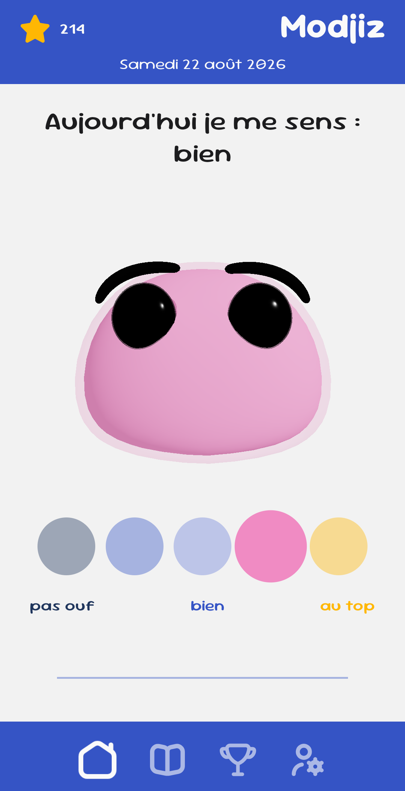
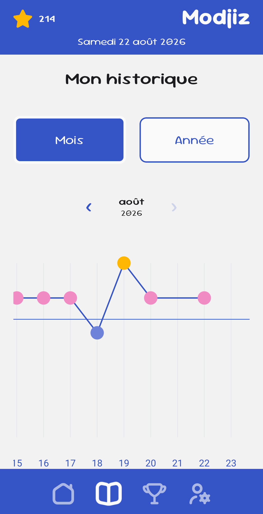

Marc - Fullstack Web & Mobile Developer

I build modern, user-focused web and mobile applications with React, Next.js and Expo, from interactive interfaces to backend services.

Coming from a design-oriented background, I pay particular attention to UX, visual details, interactive experiences and clean architecture.

I'm curious and creative by nature, always looking for new ways to turn ideas into concrete projects.

<h2  style="padding-top: 32px"  align="center">- Languages and tools -</h2>

<i>Crafting interfaces, exploring dimensions</i>

<table style="border-collapse: collapse; border: none;">
  <tr style="border: none;">
    <td style="padding-bottom: 16px; padding-right: 15px; vertical-align: middle; border: none;">
      <strong>Languages</strong>
    </td>
    <td style="padding-bottom: 16px; border: none;">
      
      
      
      
    </td>
  </tr>

<tr style="border: none;">
    <td style="padding-top: 16px; padding-right: 15px; vertical-align: middle; border: none;">
      <strong>Web & Mobile</strong>
    </td>
    <td style="padding-top: 16px; border: none;">
      
      
      
    </td>
  </tr>

<tr style="border: none;">
    <td style="padding-top: 16px; padding-right: 15px; vertical-align: middle; border: none;">
      <strong>Backend</strong>
    </td>
    <td style="padding-top: 16px; border: none;">
      
      
      
    </td>
  </tr>

  <tr style="border: none;">
    <td style="padding-top: 16px; padding-right: 15px; vertical-align: middle; border: none;">
      <strong>Tools</strong>
    </td>
    <td style="padding-top: 16px; border: none;">
      
    
    
    
    </td>
  </tr>

  <tr style="border: none;">
    <td style="padding-top: 16px; padding-right: 15px; vertical-align: middle; border: none;">
      <strong>Design & 3D</strong>
    </td>
    <td style="padding-top: 16px; border: none;">
      
      
      
    </td>
  </tr>
</table>

<h2 style="padding-top: 32px" align="center">- Featured Project -</h2>

  A mobile mood tracking application designed to help users visualize and understand their emotional patterns over time. It combines daily mood tracking, statistics, and an interactive interface enhanced by a dynamic 3D character.

- Daily mood tracking with intuitive input

- 3D character reflecting user emotions

- Statistics and mood evolution over time

- Secure user authentication and account management

- Native Android application

<h3 style="padding-top: 32px" align="center">- Presentation -</h3>

  
  

  

<h3>What this project demonstrates:</h3>

- Building and deploying a complete mobile application from scratch with React Native and Expo

- Developing and distributing Android applications through Google Play

- Authentication flows with email verification and password recovery

- Deep linking and authentication redirects between emails and the mobile application

- PKCE-based authentication and user session handling

- State management and persistent user data with Supabase

- Secure transactional email delivery with custom templates

- Interactive UI development with a dynamic 3D component

- Scalable component architecture and maintainable code organization

- Local Android production builds with Gradle and release signing

- Writing tested and maintainable code with Jest

<h2 style="padding-top: 32px" align="center">- Connect with me -</h2>

  
  <a href="https://github.com/pyxhd">
    <picture>
  <source srcset="https://cdn.jsdelivr.net/gh/devicons/devicon/icons/github/github-original.svg" media="(prefers-color-scheme: light)">
  
</picture>
  </a>

  

